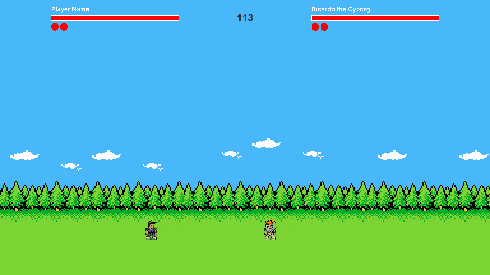
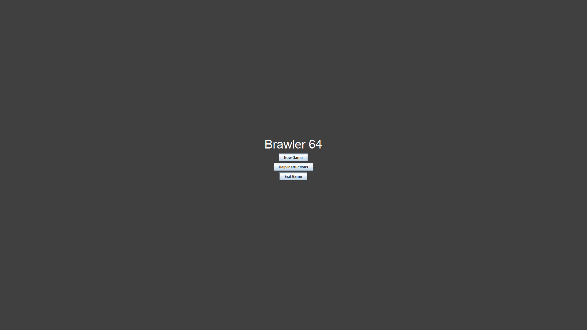
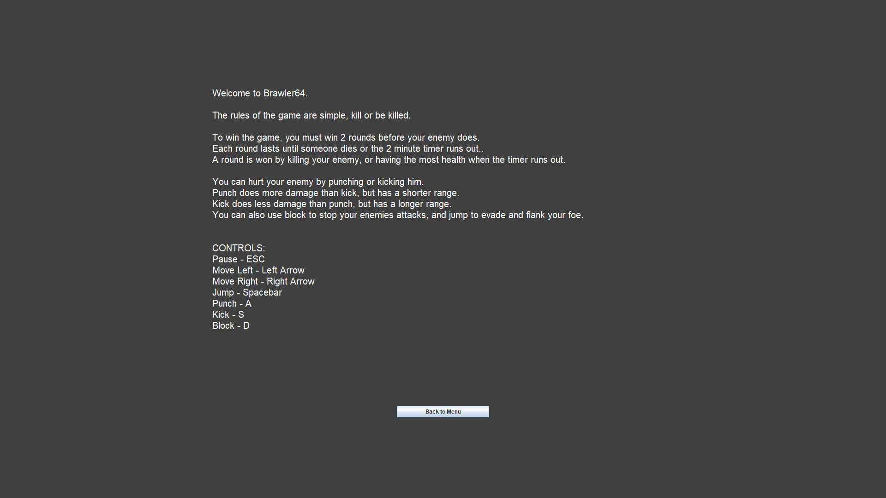

# BRAWLER 64

## Description
Brawler64 is a brawler style game that is inspired by mortal kombat and street fighter. 
The rules and controls of the game are available in the main menu of the game and in the Instructions.txt file.

## How to Run
To run the game, run the Brawler64.jar file with the Java SE Binary (Version 1.8 151).

**Performance**
If you are experiencing performance issues, try turning off the sound and/or run the game in windowed mode.
If you run the application using a console (like cmd), you will be able to see the games active ticks and frames per second outputed to the console.

## How to Play

